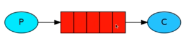
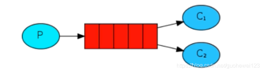
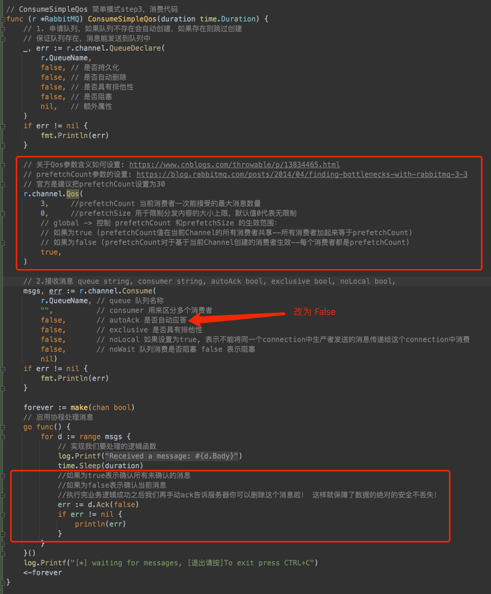
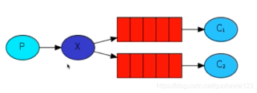
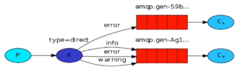

# RabbitMQ 的五种工作模式
RabbitMQ主要使用场景
1. 程序解耦利器
2. 流量消峰
3. 异步处理

**5种模式的GO 代码实现**： https://github.com/laosuaidami/RabbitMQWorkerMode

## 一. Simple模式

- 生产者发送消息到队列中，消费中从队列中获取消息。每个消息只能被一个消费着消费，即：当消息被消费者获取后，该消息将会在队列中移除。这中模式也可以成为“阅后即焚”。
- 隐患: 消息可能没有被消费者正确处理，已经从队列中消失了，造成消息的丢失

    

## 二. 工作模式

- 一个生产者、多个消费者；一个消息只能被一个消费者获取。
- 在这种模式中又可以分为两种模式，
  - 轮询模式：每个消费者均分消息
  - 公平分发模式（能者多劳）：按能力分发，处理速度快的分发的多，处理速度慢的分发的少

  

### 1. 轮询模式

轮询模式无论有多少个消费者，不管每个消费者处理消息的效率，都会将所有消息平均的分发给每一个消费者，也就是说，大家最后各自消费的消息数量都是一样多的。

### 2. 消息丢失
- 开启了自动应答，如果消息队列将消息分发给消费者，那么就会从队列中删除，如果在我们处理任务的过程中，处理失败或者服务器宕机，那么这条消息肯定得不到执行，就会出现丢失。
- 如果任务在处理的过程中，如果服务器宕机等原因造成消息未被正常消费，那么必须分发给其他的消费者再次进行消费，这样即使服务器宕机也不会丢失任何的消息了。
- 所以ACK，就是消息应答机制，如果代码是开启了自动应答，我们的消息没被正常消费，就会丢失。
- 要想确保消息不丢失，就必须将ACK自动应答关闭掉，在我们处理消息的流程中，如果消息正常被处理，那么最后进行手动应答，告诉队列我们正常消费了消息。
- RabbitMQ它是没有我们平常所见到的超时时间限制的，只要当消费者服务宕机，消息才会被重新分发，哪怕处理这条消息需要花费很长的时间。

### 3. 公平分发消息与消息应答（ACK）
- 我们提供多个消费者，目的就是为了提高系统的性能，提升系统处理任务的速度，如果将消息平均的分发给每个消费者，那么处理消息快的服务是不是会空闲下来，而处理慢的服务可能会阻塞等待处理，这样的场景是我们不愿意看到的。
- 所谓的公平分发，其实用能者多劳描述更为贴切，根据名字就可以知道，谁有能力处理更多的任务，那么就交给谁处理，防止消息的挤压。
- **那么想要实现公平分发，那么必须要将自动应答改为手动应答**。这是公平分发的前提。

  

## 三. Publish/Subscribe,  订阅模式

- 消息被路由投递给多个队列，一个消息被多个消费者获取。
- 相关场景：邮件群发，群聊天，广播 (广告)

## 四. Routing, 路由模式

- 一个消息被多个消费者获取。并且消息的目标队列可被生产者指定。
- 交换机的类型是 direct 类型 在订阅模式下是 faout 广播类型

## 五. Topic, 话题模式

- 一个消息被多个消费者获取。消息的目标queue可用BindingKey，以通配符的方式指定。（#：匹配一个或多个词，*：匹配一个词）

